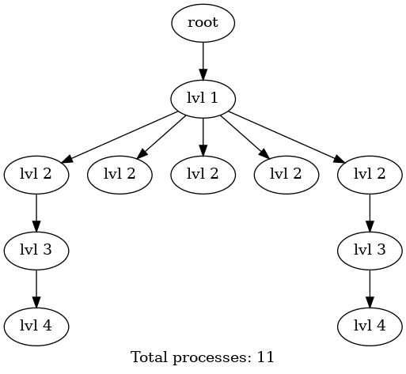
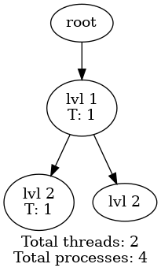

# forktree

This is a small library I made to help study for my Operating Systems exam.

## What is it useful for?

The exam involves an exercise where you either have to write code to generate a given process tree, or to draw the process tree generated by a given piece of code.
This library generates a Graphviz description of the process tree, which can be used to draw the tree using the `dot` command.
A Makefile is included to generate the image automatically.

 

## How do I use it?

There are two functions provided:

- `frk()` is used to fork a new process. Replace all `fork()` calls in your code with `frk()`. Using `fork()` may cause malfunctioning of the library.
- `thread_create()` simulates the creation of a new thread. The drawn graph will specify the number of threads created by each process, and in total.
  This does not actually create a new thread, it just simulates it for the purposes of the exercise (a real thread would require a function to start running).
  It is assumed that threads are not copied when a fork is made (this is the Linux and POSIX behavior), and that the threads don't create any forks of their own.

You do not need to manually `wait` for the child processes, the library will do that for you with an exit handler.
Avoid crashing the program (i.e. using `abort()`, or segfaulting) as the exit handler will not be called in that case, preventing the graph from being printed correctly.
Normal exit via `exit()` or returning from `main()` is fine.

Just add your code to the `src` folder. Each C file is compiled into a separate executable, and is run to generate the process tree.

Run `make` to generate the process tree, and `make clean` to remove the generated files.

You can also manually generate an image using `make out/yourprog; out/yourprog | dot -Tpng -o out/yourprog.png`. Or `out/yourprog | dot -Tx11` to display the graph in a window.

## How does it work?

The first time you call a library function, it will initialize a few hidden global variables, including some mmap-ed shared memory for the total process and thread count.
An exit handler is registered with `atexit` to print the label of the process and the number of threads it created, and to close the graph in the root process.

## Requirements

- Linux (other Unix-like systems may work, but are untested). If you use Windows I recommend setting up WSL. You can use Visual Studio Code to edit your code and run it in WSL using the WSL extension.
- Graphviz: install it with `sudo apt install graphviz` on Ubuntu, or look it up for your distro
- GCC: you can set the environment variable `CC` to use a different compiler, e.g. `CC=clang make` to use Clang.
  Compilers other than GCC and Clang are untested.
- GNU Make: it should be installed by default. You can also manually compile the code and generate the image if Make doesn't work for some reason.
